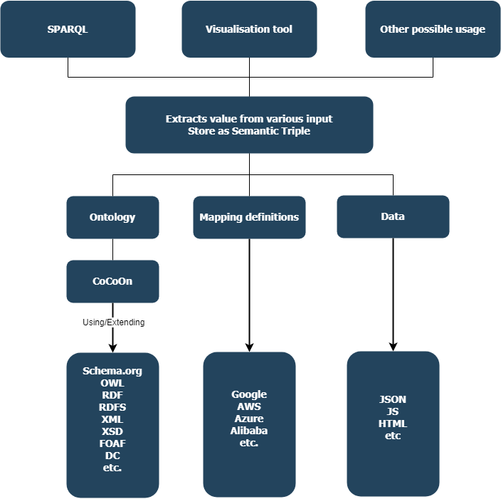

# Request ontology from url
[GET rdf/ttl via Ajax](ajax.html)

# JSON-LD Macros example
https://miranda-zhang.github.io/cloud-computing-schema/json-ld-macros/gcloud.html

Created with https://github.com/ariutta/json-ld-macros

# Mapping data to ontology


List of examples:
1. [Google Cloud VM instance](gcloud_vm.md)
2. [Google Cloud Storage](gcloud_storage.md)
3. [Google Cloud OS images](gcloud_os.md)
   
## Link Regions with GeoNames Ontology
How regions from each Cloud provider are linked to GeoNames
are exlained in:
1. [Google Cloud Region](gcloud_region.md) 

## Units of Measure
CoCoOn used vocabularies from [QUDT Unit ontology](QUDT_unit.md).
And [defined additional units](unit.md)
with reference to QUDT.

# SPARQL
Tested with Protégé.
Default Example:
```
PREFIX rdf: <http://www.w3.org/1999/02/22-rdf-syntax-ns#>
PREFIX owl: <http://www.w3.org/2002/07/owl#>
PREFIX rdfs: <http://www.w3.org/2000/01/rdf-schema#>
PREFIX xsd: <http://www.w3.org/2001/XMLSchema#>
SELECT ?subject ?object
WHERE { ?subject rdfs:subClassOf ?object }
```

Examples with the following keywords:
1. [SELECT FILTER ORDER BY LIMIT](sparql/filter_vm_order_desc_limit.md)
2. [DISTINCT](sparql/vm_less_or_equal_4cores.md)

Additional external examples
https://www.w3.org/2009/Talks/0615-qbe/
